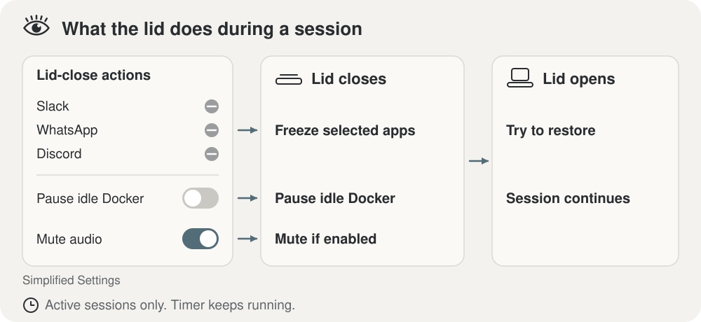
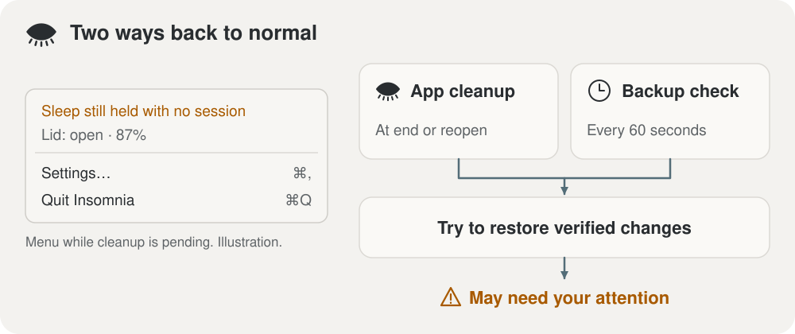

<p align="center">
  
</p>

<h1 align="center">Insomnia</h1>

<p align="center">
  <strong>Keep your Mac awake. Give the session an end time.</strong>
</p>

<p align="center">
  A native macOS menu bar app for timed awake sessions. Pick a duration for your
  long-running work, choose what happens when the lid closes, and see when
  recovery needs your attention.
</p>

<p align="center">
  <a href="#install"><strong>Install</strong></a> ·
  <a href="#using-it"><strong>Using it</strong></a> ·
  <a href="#how-recovery-works"><strong>Recovery</strong></a> ·
  <a href="SECURITY.md"><strong>Security</strong></a>
</p>

<p align="center">
  <a href="LICENSE"></a>
  
  
</p>

> **Use a stable, well-ventilated surface—not a closed bag.** Insomnia is
> experimental, source-built software, not a signed and notarized consumer
> download. Recovery can fail; a running timer is not a safety guarantee.
> [Validation status](docs/release-validation.md) · [Apple's ventilation guidance](https://support.apple.com/en-us/102336)

<p align="center">
  
</p>

## Install

Requires **macOS 26 or later** and **Xcode with Swift 6.2 or later**. Installation
currently means building from source:

```bash
git clone https://github.com/kgarg2468/Insomnia.git
cd Insomnia
./scripts/install.sh
open "$HOME/Applications/Insomnia.app"
```

The installer builds and ad-hoc signs the app, installs a background recovery
agent, and asks for administrator access to install a narrowly scoped sudoers
rule. It grants **your user account**, not just Insomnia, passwordless access to
four power-setting commands. Review that permission before installing.

<details>
<summary><strong>Exactly what gets installed</strong></summary>

| Location | Purpose |
| --- | --- |
| `~/Applications/Insomnia.app` | The menu bar app |
| `~/Library/Application Support/Insomnia/` | Configuration, session/recovery journals, and `backstop.sh` |
| `~/Library/LaunchAgents/com.insomnia.backstop.plist` | Per-user recovery agent |
| `~/Library/Logs/Insomnia/` | `insomnia.log` and `handoffs.log` |
| `/etc/sudoers.d/insomnia` | Permission for the four commands below |

```text
/usr/bin/pmset -a disablesleep 1
/usr/bin/pmset -a disablesleep 0
/usr/bin/pmset -b lowpowermode 1
/usr/bin/pmset -b lowpowermode 0
```

The grant is available to other processes running as your user. Insomnia is not
sandboxed. The app, scripts, and journals are local; hotspot passwords use the
login Keychain, not the configuration file.

An upgrade asks the running app to quit and stops if it refuses. A process
is matched by its executable path (the installed bundle) or by its bundle id,
not by its name, so the Insomnia API client (`com.insomnia.app`), whose
executable is also named Insomnia, is reported and left alone. A process named
Insomnia with any other bundle id, or one that cannot be read, counts as this
app and blocks the upgrade until it exits; it is never asked to quit. Once
the installer holds the recovery lock it reads no Info.plist, so a bundle on a
stalled volume cannot hold the lock; a process it first sees then counts as
unverified and blocks. A
copy running in another account, or a process there that cannot be told apart
from one, stops the install before the sudoers rule is replaced, since that
copy may need the rule; it is named and never asked to quit. A
refusal names the pid and executable path it found. Unresolved
recovery prevents replacing the existing recovery agent; follow the reported
instructions before retrying.

</details>

## Using it

1. **Start:** click the eye in the menu bar, enter Days / Hours / Minutes, and
   press Enter.
2. **Extend:** click the eye or countdown during a session and enter more time.
3. **End early:** press and hold the end control beside the countdown.
4. **Inspect or configure:** right-click for status, recovery warnings,
   **Settings**, and **Quit Insomnia**. Quitting requests session cleanup and
   can be refused while required recovery remains.

You do not need to close the lid to use a timed session. Opening the lid does
not end it, and a sleeping display is not the same as a sleeping Mac.

Before the first session, review the settings. Some lid actions are on by
default, including pausing the apps on the freeze list (Slack, WhatsApp and
Discord) while the lid is closed; pausing every other Dock app is off until
you turn it on. Start with a short, supervised session on a ventilated surface
and check the status menu and `~/Library/Logs/Insomnia/insomnia.log` afterward.

## What happens when the lid closes

<p align="center">
  
</p>

During a session, Insomnia turns the display and keyboard backlight off
(saving their brightness first), pauses the apps on the freeze list (and, if
you opt in, every other Dock app that is not an agent app), checks whether
Docker Desktop is idle before pausing it, and can save then mute audio.
Reopening the lid attempts to undo those lid actions. **The timer keeps
counting down while the lid is closed**; only its on-screen redraw pauses.

The display step exists because the sleep guard stops macOS from doing it:
with sleep disabled, closing the lid no longer turns the panel or the keys off
by itself. Insomnia sets both to zero and restores them when the lid opens.
The display comes back to the brightness sampled while the lid was open, not
the reading at the moment of closing (auto-brightness has already dimmed the
panel under the closing lid by then, and Low Power Mode rescales it), and if
Insomnia's own Low Power Mode was on while the lid was closed the value is
written once more when the mode ends. If Insomnia is not running when you open
the lid, press the brightness-up key.

The defaults are worth knowing:

- **Selected apps:** Slack, WhatsApp, and Discord are on the freeze list.
  Configured agent apps are excluded from this ordinary list.
- **Every other app:** "Freeze every other app while the lid is closed" is
  off, so a fresh install pauses the freeze list only. Turn it on to also pause
  every Dock app that is not an agent app, an Apple app, Docker Desktop or a
  built-in protected app (editors, terminals, browsers, AI apps, password
  managers, local databases, Tailscale, local model servers; JetBrains IDEs by
  bundle-id prefix), so only agents keep running with the lid shut. Menu-bar
  apps are never picked up automatically; add them to the freeze list if you
  want them paused. Settings shows a "Would freeze now" line listing what the
  automatic scope would pause at that moment.
- **Docker rule:** enabled, with a separate local Docker Desktop idle check.
  Container startup can race that check; disable the rule for important Docker
  workloads where an unexpected pause would be disruptive.
- **Mute on close:** off.
- **Display and keyboard backlight:** on ("Turn off the display and keyboard
  backlight" in Settings). Both values are saved to the journal before they
  are changed.
- **Low Power Mode while the lid is closed:** on. With sleep disabled a closed
  Mac otherwise keeps running at full speed; the mode is switched off again
  when the lid opens, unless a battery or thermal rule still wants it.
- **Battery rules:** below 40% on battery, request Low Power Mode; below 10%,
  end the session. A battery that is present but cannot be read on two
  consecutive reads while on battery also ends the session, with a
  notification saying why: the floor cannot be applied to a level nobody can
  read. One failed read is tolerated, and the level is re-read every 30 s
  until it is readable again. A desktop has no battery and no floor. Serious
  thermal state requests Low Power Mode; critical thermal state ends the
  session. These rules require the app to be running.
  Setting the end floor to 0 turns the battery end off. Otherwise the end
  floor stays below the Low Power Mode floor. The Settings steppers move the
  other floor when the two would cross, and a hand-edited `config.json` with
  the floors out of order is corrected at launch, and logged, by raising the
  Low Power Mode floor.

To exercise the lid actions without closing the lid, run
`scripts/simulate-lid.sh closed` and then `scripts/simulate-lid.sh open` during
a session; the app runs the same actions it would on a real lid event. Only a
build with the file watcher compiled in reads that trigger: a debug build, or
a release build installed with `INSOMNIA_LID_SIMULATION=1 ./scripts/install.sh`.
A normal install has no watcher, so no program running as your user can replay
the lid actions by writing a file. A build that has it logs "Lid simulation
build" at launch and shows the same line in the status menu and in Settings.

## How recovery works

<p align="center">
  
</p>

Insomnia records pending changes in a recovery journal. On session end, the app
attempts to undo them. An independent `launchd` agent checks every minute and
can attempt recovery after the app exits unexpectedly, once the saved deadline
has passed. It leaves a valid, unexpired session alone.

The app and backstop use the same lock so they do not restore and rewrite the
journal over one another. Failed restoration keeps the relevant entries;
unreadable journals are preserved instead of treated as clean. A session file
that does not parse counts as expired and is renamed to
`session.json.unreadable-<time>` beside it, never deleting or overwriting
anything: the app does this at launch, before restoring whatever the journal
holds, and says where the file went; the agent does it once the journal is
clean. A session file that cannot be read at all (permissions, or not a
regular file, which is never opened) also counts as expired, since its end
time is unknown: the journal is restored and the file is renamed the same
way without being opened, so a later launch cannot resume a session that
was treated as ended. The app says where it went. If the rename fails, the
app keeps trying it and will not quit until the file is gone.
`uninstall.sh --purge` removes the renamed copies that are regular files;
without `--purge` they stay.

**Recovery is not “everything always gets undone.”** The backstop does not
monitor battery or temperature. Saved audio needs the app to reopen, and
unconfirmed process freezes may need manual inspection. If a warning remains,
resolve it before leaving the Mac unattended. Real-machine crash, reboot, and
installation scenarios still need [release validation](docs/release-validation.md).

<details>
<summary><strong>Recovery limits and manual attention</strong></summary>

- **Process ownership:** automatic resume checks the recorded process start
  time and boot session. The app journals each pid before it sends SIGSTOP,
  and sends nothing when that write fails. The identity is added only after
  the kernel confirms Insomnia's own stop, so a process somebody else had
  stopped is never resumed. If the confirming write fails, the app sends
  SIGCONT at once to each pid it just stopped whose identity still matches,
  even one that does not show as stopped yet: SIGCONT also cancels a stop
  that is still pending. It then drops those entries from the journal,
  shows the failure in the status menu, and stops counting them as frozen
  even if the disk refuses that write too. If the app dies between the stop and that write,
  the stopped pids stay journaled without identity, like entries from builds
  that recorded the pid alone, and are not automatically resumed while
  stopped. Verify the live process and whether it should be resumed; never
  blindly signal a PID from an old log.
- **Identity is not an atomic guarantee:** the app checks start time to the
  microsecond; the shell checks to the second. A lookup and a signal are still
  separate operations.
- **Stuck power commands:** a command that survives its timeout keeps the
  recovery lock until it exits. Other recovery attempts or new sessions wait
  or fail with a warning instead of running alongside it.
- **Audio:** the backstop preserves volume/mute entries but cannot restore
  CoreAudio. Reopen the app for recovery.
- **Sleep disabled by something else:** at launch, with no session and no
  journal entry, a `SleepDisabled 1` in `pmset -g` is left alone: Insomnia
  did not set it and only its owner should undo it. The menu shows a warning
  and a notification gives the command, `sudo pmset -a disablesleep 0`.
  Ending an Insomnia session sets it to 0 whoever set it.
- **Low Power Mode:** Insomnia checks the existing setting so it does not
  claim ownership of an already-enabled preference.
- **App Nap:** off by default. When the setting is on, Insomnia journals each
  agent app's previous `NSAppSleepDisabled` value before writing it and puts
  it back at session end, in the backstop, and in uninstall. Values an older
  build wrote without a record are not guessed at: uninstall prints the
  `defaults delete` command for each one and continues.
- **Uninstall:** refuses to remove recovery machinery while unresolved changes
  remain. A failed uninstall is not confirmation that power settings are normal.

</details>

## Optional extras

<details>
<summary><strong>iPhone hotspot handoff and tmux</strong></summary>

Set **System Settings → Wi-Fi → Ask to join hotspots → Automatically**, then
enter the hotspot SSID and password in Insomnia Settings. The password is
stored in the login Keychain under service `insomnia-hotspot`. Insomnia uses
CoreWLAN to find and join that network without putting the password in process
arguments.

macOS requires Location Services permission to reveal network names. Insomnia
requests it on the first hotspot save, or when starting a session with a
configured hotspot—not merely on launch. If denied, use the Location row in
Settings to open **Privacy & Security → Location Services**. Mac apps have no
when-in-use grant, so System Settings records it as Location Services access
for Insomnia. Insomnia uses it only to read Wi-Fi network names through
CoreWLAN and never requests your location.

After a long outage (90 seconds by default) Insomnia types `continue` into
each configured tmux target. The default target list is empty, and a listed
pane is only nudged if you have marked it yourself, with a pane option that
is read again before every send:

```bash
tmux set-option -p -t <session:window.pane> @insomnia-nudge on
```

Mark a dedicated, disposable agent pane, not one you type in, because pending
text is opaque to Insomnia. Enter is off by default, so the word is typed and
nothing submits it. Turn on "Press Enter after continue" in Settings to submit
it, knowing that Enter also submits anything already typed in that pane. The
option must be on the pane itself (`-p`). One set on the session or window
does not count. Pane options need tmux 3.0 or later. Ending a session cancels
pending automation but cannot retract keystrokes already sent.

</details>

<details>
<summary><strong>Chrome, Chromium, and Arc throttling</strong></summary>

Chromium browsers can throttle windows macOS considers occluded, including
when the lid is closed. Insomnia detects supported running browsers missing
`--disable-backgrounding-occluded-windows` or `--disable-renderer-backgrounding`
and offers **Relaunch [browser] unthrottled** in the right-click menu. The item
asks first, because the browser is quit and its windows and tabs come back only
if it is set to reopen them on startup. If the browser has quit by the time you
confirm, nothing is quit or launched and a notification says so. Insomnia reads the browser's profile
arguments before quitting and carries them over. If it cannot read them, cannot
read the kernel's start time that ties them to the browser, or the browser
quits on its own while they are read, it quits nothing and says so. If the
browser has not quit after 10 s, nothing is launched, and a notification says
so: a second copy beside the first would be worse than a throttled one. The
quit request stands, so a browser that closes later has to be opened again by
hand. After `open` returns, Insomnia waits up to 5 s for the browser to show up
as running and notifies if it does not. Each of these reasons also stays in the
right-click menu as a warning line, one per browser, until that browser's next
relaunch or the next session, so it is there even with notifications off. A
relaunch that ends after its session ended, or after a newer relaunch of the
same browser started, reports nothing. This is not a guarantee that every web
app will keep working while the lid is closed.

</details>

<details>
<summary><strong>Configuration and privacy</strong></summary>

Configuration lives in `~/Library/Application Support/Insomnia/config.json`.
Use Settings for the app's controls; [Config.swift](Sources/Insomnia/Model/Config.swift)
defines the full configuration and defaults. Local logs can contain SSIDs,
process metadata, and tmux targets. Check them before sharing publicly.
Lines the app writes to `insomnia.log` also go to the unified log with their
bodies marked private, so `log show` and other local programs see `<private>`
in place of the text unless private data logging is enabled on the Mac. The
backstop's lines go only to `insomnia.log`, which keeps the full text of both.

`INSOMNIA_HOME` relocates app support files, logs, and LaunchAgents for testing.
It is **not an installation sandbox**: installation/removal also involves the
app bundle and sudoers rule. The installer refuses a relocated home. See
[Paths.swift](Sources/Insomnia/Store/Paths.swift) for the layout.

</details>

## Uninstall

From your checkout:

```bash
./scripts/uninstall.sh
# Also remove Insomnia-owned configuration and logs:
./scripts/uninstall.sh --purge
```

The uninstaller requests cleanup before removing the app, agent, and sudoers
rule. If recovery is incomplete or the app refuses to quit, it stops and names
the pid and executable path of the copy still running; resolve the reported
problem and retry. The Insomnia API client (`com.insomnia.app`) is reported and
left alone. A process named Insomnia with any other bundle id, or whose bundle
id cannot be read, or whose Info.plist does not answer within the
uninstaller's time limit for a call, blocks the uninstall until it exits. A copy running in another account stops
the uninstall before anything is removed, and is never asked to quit. The
sudoers rule is one file for the whole Mac and names the account that installed
last. The uninstaller reads it through sudo and removes it only when it is
exactly the rule the installer writes for your account; otherwise it keeps the
file and says why. Purge removes owned files, not arbitrary
directory contents. A small shared lock file is retained to keep concurrent
recovery operations coordinated.

## Development

```bash
swift build
swift test
```

CI runs Swift tests, a release build with warnings as errors, a bash 3.2
syntax check of the scripts, ShellCheck, and actionlint plus zizmor over the
workflows. tmux integration tests need tmux installed; check skip counts
rather than assuming missing integration coverage passed. Tests use injected
dependencies and temporary fixtures—not live installation or power changes
on a contributor's machine.

The app icon is the menu bar's open eye on a charcoal tile: [AppIconArtwork](Sources/Insomnia/UI/AppIconArtwork.swift) draws it from the same [vector geometry](Sources/Insomnia/UI/EyeMarkGeometry.swift) as the menu bar's closed eye, which opens while a session runs.
After changing the artwork, run `./scripts/generate-app-icon.sh` to regenerate
the packaged PNG and ICNS assets and the README's SVG. The script draws them
offline with Xcode's swiftc and iconutil.

[Contributing](CONTRIBUTING.md) · [Security reporting](SECURITY.md) ·
[Release validation](docs/release-validation.md) · [Design notes](docs/spec.md)

## License

[MIT](LICENSE)
